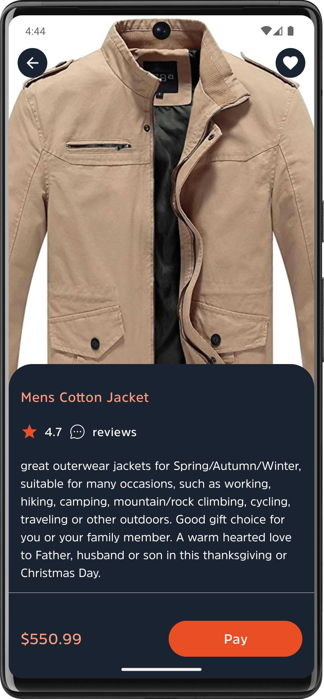
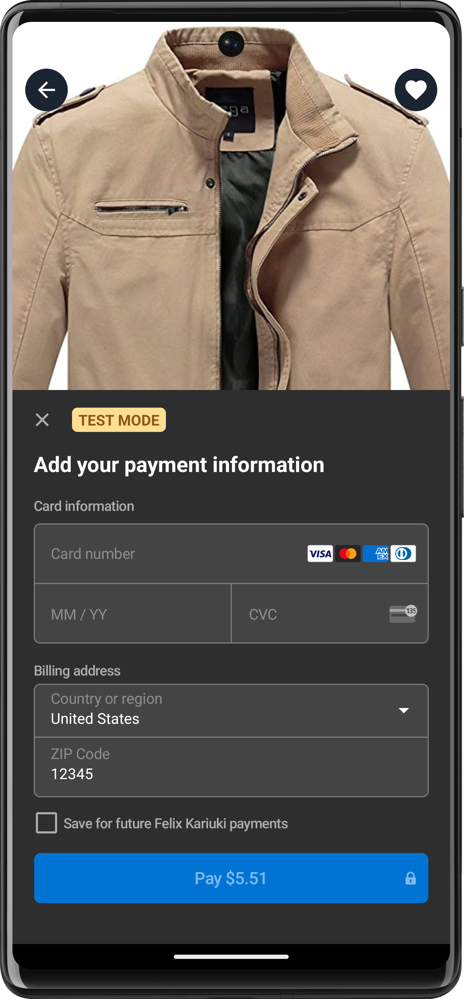
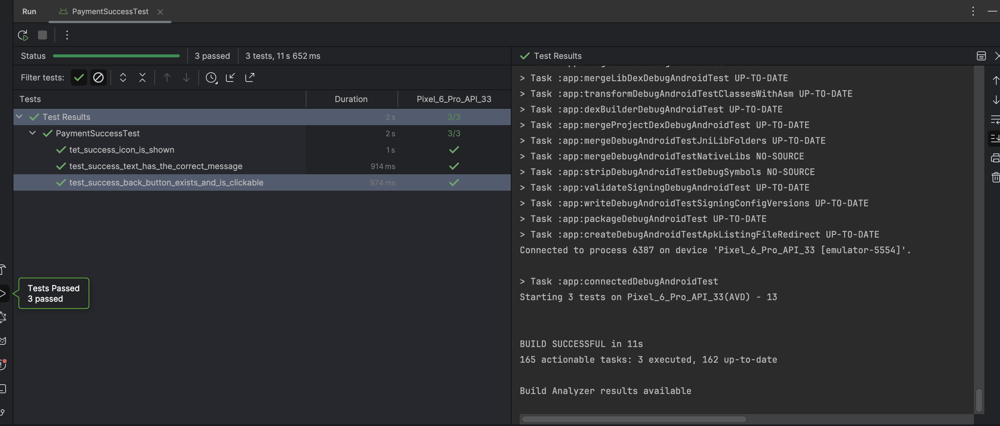
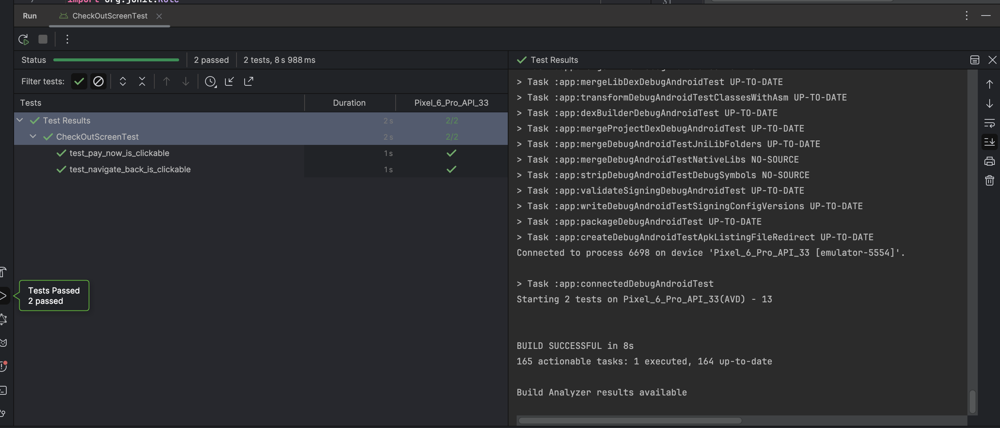
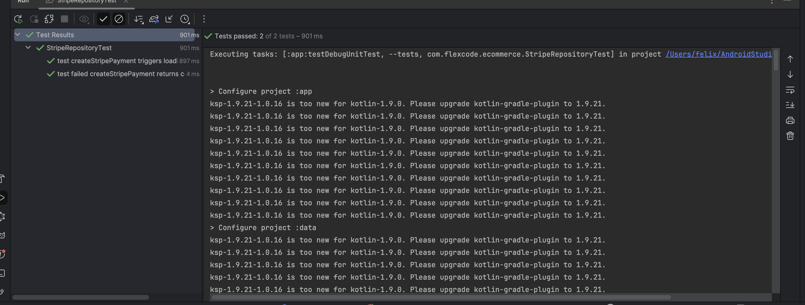

# MoneySwift - I&M Mobile Code Test 

MoneySwift is a (fictitious) Fintech company that provides an e-commerce solution

You are tasked with creating a basic Android app that simulates a simple e-
commerce platform. The app should display a list of products (at least 3-5 items)

and allow the user to select products and proceed to a checkout screen where
they can enter payment information via Stripe.

The app displays a list of 5 products from a local listings.json generated from the fakestore API 


## Features
 - Products List
 - Check out
 - Stripe Intergration

## Prerequisites

1. Android studio - Iguana +
2. test device an android device either simulator or physical device
3. Stripe test creds -  I have provide the test creds i used to test build the project. The creds can be found in the `domain` module under the `utils` package in the `Constants` file. If you wish to replace the creds with your own then find the Constants file and replace with your own. 

```KOTLIN
 const val SECRET_KEY = "SECRET_KEY_HERE"

 const val PUBLISH_KEY = "PUBLISH_KEY_HERE


 const val BASE_URL = "STRIPE_BASE_URL_HERE"

```

  ### How to run

[APK Link](https://we.tl/t-oQWV6kzJ7L) - To install directly the apk without running the project On the IDE find the attched apk

#### Running on IDE

 - Go to the android studio and create a new project using the 'Get from version control' option.
 - Paste this link https://github.com/Felix-Kariuki/MoneySwift
 - Build the project and run it
 - Get Ready Apk [here](https://we.tl/t-oQWV6kzJ7L)


## **Screenshots 📷**
| | | |
|:-------------------------:|:-------------------------:|:-------------------------:|
| |  |  |
|  | 

## Demo

<!--https://github.com/Felix-Kariuki/MoneySwift/assets/61313608/78b28da9-5cc1-461a-9cab-3a000009f305-->

https://github.com/Felix-Kariuki/MoneySwift/assets/61313608/336f3b68-d13d-4b07-8f4f-6c57caed83da


## Testing 
Sample screenshots the test cases written . To find the test cases, explore the :app module testing packages
  
  
  
 
  


## **Tech stack & Libraries 🛠️👨‍💻**
 - [Kotlin](https://kotlinlang.org/docs/reference/) - Kotlin is a cross-platform, statically typed, general-purpose programming language with type inference. Kotlin is designed to interoperate fully with Java, and the JVM version of Kotlin's standard library depends on the Java Class Library, but type inference allows its syntax to be more concise
 * [Jetpack Components:](https://developer.android.com/topic/architecture?gclid=Cj0KCQjw8O-VBhCpARIsACMvVLOH1satX45o9f4PMQ4Sxr7bG9myl6-KZL9nYda8PJsHV7m2uJL8bzgaAmqiEALw_wcB&gclsrc=aw.ds)
    * [Jetpack Compose](https://developer.android.com/jetpack/compose?gclid=Cj0KCQjwhqaVBhCxARIsAHK1tiMMwHsxQ8Z25jyEdtLha9erq11wROoEfL6RqpGMprgbDTNuMO3_Ri8aAu5EEALw_wcB&gclsrc=aw.ds) -  Android’s modern toolkit for building native UI. It simplifies and accelerates UI development on Android
    * [View Model](https://developer.android.com/topic/libraries/architecture/viewmodel)-  store and manage UI-related data in a lifecycle conscious way.
    * [Lifecycle]( https://developer.android.com/topic/libraries/architecture/lifecycle) - Perform actions in response to a change in the lifecycle status of another component, such as activities and fragments.
    * [LiveData](https://developer.android.com/topic/libraries/architecture/livedata.html) - A lifecycle-aware data holder with the observer pattern
    * [Android KTX](https://developer.android.com/kotlin/ktx.html) - Android KTX is a set of Kotlin extensions that are included with Android Jetpack and other Android libraries. KTX extensions provide concise, idiomatic Kotlin to Jetpack, Android platform, and other APIs.
    * [AndroidX](https://developer.android.com/jetpack/androidx) - Major improvement to the original Android [Support Library](https://developer.android.com/topic/libraries/support-library/index), which is no longer maintained.


* [Dagger-Hilt](https://dagger.dev/hilt/)- a dependency injection library for Android that reduces the boilerplate of doing manual dependency injection in your project
- [Kotlinx-serilization](https://github.com/Kotlin/kotlinx.serialization) - Kotlin multiplatform / multi-format serialization.
- [ktor](https://ktor.io/docs/welcome.html) - Ktor is a framework to easily build connected applications – web applications, HTTP services, mobile and browser applications.
* [Coroutines](https://developer.android.com/kotlin/coroutines) - a concurrency design pattern that you can use on Android to simplify code that executes asynchronously
* [Flow](https://developer.android.com/kotlin/flow)- In coroutines, a flow is a type that can emit multiple values sequentially, as opposed to suspend functions that return only a single value.

* [CI/CD](https://codemagic.io/android-continuous-integration/) - Continuous integration systems let you automatically build and test your app every time you check in updates to your source control system. 

* [Coil](https://coil-kt.github.io/coil/compose/) - Image Loader library.

 * [Compose Navigation]()
 * [Stripe Android SDK](https://docs.stripe.com/libraries/android) - The Stripe Android SDK allows you to quickly build a payment flow in your Android app. We provide powerful and customisable UI elements that you can use out-of-the-box to collect your users’ payment details. We also expose the low-level APIs that underpin those UIs so that you can build fully custom experiences.
 * [Ktlint](https://github.com/pinterest/ktlint) - An anti-breakshedding Kotlin linter with built-in formatter

## Modularization and project struecture
The project is modularized by layer as a way of showcasing the power of project modularization and separation of concerns.The modules are:
### - presentation 
 The role of the UI layer (or presentation layer) is to display the application data on the screen. Whenever the data changes, either due to user interaction (such as pressing a button) or external input (such as a network response), the UI should update to reflect the changes.
The UI layer is made up of two things:
## - data  
The data layer of the app contains the business logic. The business logic is what gives value to your app—it's made of rules that determine how your app creates, stores, and changes data.The data layer is made of repositories that each can contain zero to many data sources

### - domain 
The domain layer is an optional layer that sits between the UI and data layers.
The domain layer is responsible for encapsulating complex business logic, or simple business logic that is reused by multiple ViewModels. This layer is optional because not all apps will have these requirements. You should use it only when needed—for example, to handle complexity or favor reusability

### - shared  
This layer contains code that is shared across values layers in the app and may need to be accesssed by several modules. It acts as a single source of truth for all shared code, making it easy to debug and maintain the project

### - designSystem 
This layer acts as the Source of truth for the App UI and it contains a collection of reusable components, styles, and guidelines that define the look and feel of your entire application. It ensures consistency across your screens and provides a unified user experience.

